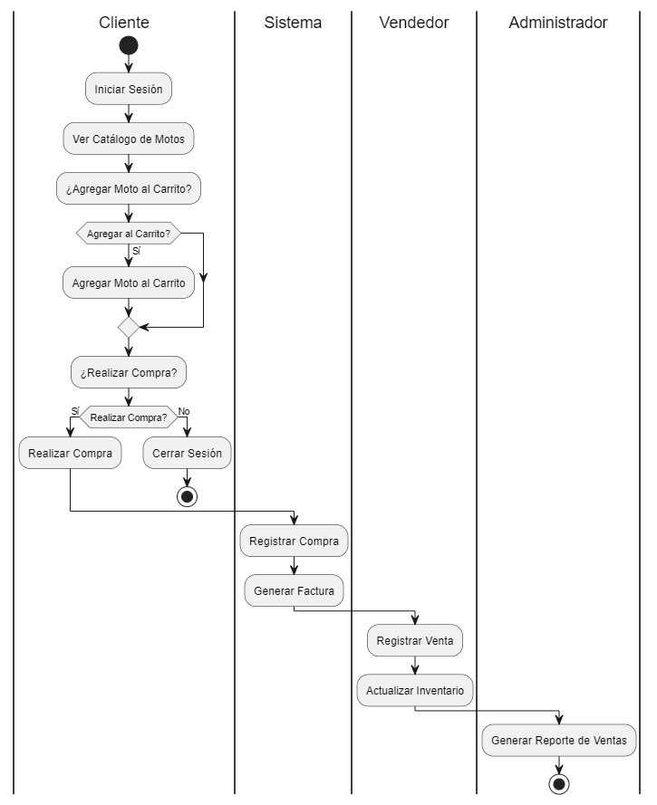

# Diagrama de Actividades - Sistema de Ventas MotoMax

Este diagrama de actividades describe el flujo de acciones principales en el sistema de ventas de MotoMax, desde que un cliente inicia sesión y visualiza el catálogo de motos hasta la generación de reportes por parte del administrador.

## Descripción del Flujo de Actividades

### 1. Iniciar Sesión
El proceso comienza cuando un **Cliente** inicia sesión en el sistema para acceder a las funcionalidades de MotoMax.

### 2. Ver Catálogo de Motos
El cliente puede ver el catálogo de motos disponible para conocer los modelos y características de cada moto.

### 3. Agregar Moto al Carrito (Decisión)
El cliente decide si desea agregar una moto al carrito. Si elige **Sí**, se ejecuta la actividad **Agregar Moto al Carrito**.

### 4. Realizar Compra (Decisión)
El cliente decide si desea proceder a realizar la compra. Si selecciona **Sí**, se lleva a cabo la actividad **Realizar Compra**. Si elige **No**, finaliza su sesión en el sistema.

### 5. Registrar Compra
El sistema registra la compra realizada por el cliente, actualizando las transacciones de venta en el sistema.

### 6. Generar Factura
Después de registrar la compra, el sistema genera una factura de la transacción, proporcionando al cliente un comprobante de su compra.

### 7. Registrar Venta
El **Vendedor** registra la venta en el sistema para completar el proceso de compra del cliente.

### 8. Actualizar Inventario
El vendedor actualiza el inventario para reflejar la cantidad de motos disponibles después de la venta.

### 9. Generar Reporte de Ventas
El **Administrador** genera un reporte de ventas, que resume las transacciones y ayuda a analizar el rendimiento de las ventas en MotoMax.

## Resumen del Flujo

Este diagrama de actividades detalla el proceso típico de compra y venta de motos en el sistema de MotoMax, destacando las acciones principales de los usuarios y el sistema. Inicia con el cliente explorando el catálogo, pasando por el proceso de compra y finalizando con el registro y generación de reportes de ventas por el administrador. Este flujo asegura una gestión ordenada de las transacciones y permite un control efectivo del inventario y las ventas.

