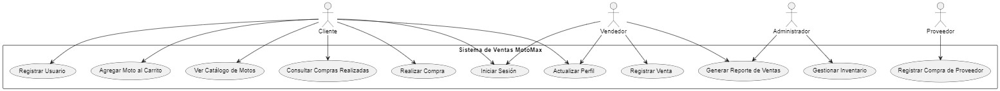

# Diagrama de Casos de Uso - Sistema de Ventas MotoMax

Este diagrama de casos de uso representa las interacciones principales entre los actores y el sistema de ventas de MotoMax. A continuación se describe cada caso de uso y su relación con los actores involucrados.

## Actores

1. **Cliente**: Un usuario que compra motos en MotoMax. Puede navegar por el catálogo, agregar motos al carrito y realizar compras.
2. **Vendedor**: Empleado de MotoMax encargado de registrar ventas y generar reportes de ventas.
3. **Administrador**: Usuario con privilegios para gestionar el inventario y monitorear reportes de ventas.
4. **Proveedor**: Responsable de suministrar motos a MotoMax, interactuando con el sistema para registrar las compras de inventario.

## Casos de Uso

### Casos de Uso Generales de Usuarios
- **Registrar Usuario**: Permite a un cliente crear una cuenta en el sistema para poder realizar compras.
- **Iniciar Sesión**: Permite a todos los actores acceder a sus respectivas funciones en el sistema.
- **Actualizar Perfil**: Los actores pueden actualizar su información personal en el sistema.

### Casos de Uso de Clientes
- **Ver Catálogo de Motos**: Permite al cliente ver las motos disponibles en el sistema.
- **Agregar Moto al Carrito**: El cliente puede agregar motos al carrito de compras.
- **Realizar Compra**: El cliente finaliza el proceso de compra para adquirir las motos agregadas al carrito.
- **Consultar Compras Realizadas**: Permite al cliente revisar el historial de sus compras previas.

### Casos de Uso de Vendedores
- **Registrar Venta**: El vendedor registra una venta en el sistema para los clientes que compran en la tienda.
- **Generar Reporte de Ventas**: El vendedor puede generar un informe con el historial de ventas, también accesible al administrador.

### Casos de Uso de Administrador
- **Gestionar Inventario**: Permite al administrador actualizar las existencias de motos y gestionar el inventario.
- **Generar Reporte de Ventas**: El administrador puede ver y analizar los reportes de ventas generados.

### Casos de Uso de Proveedores
- **Registrar Compra de Proveedor**: El proveedor registra en el sistema las motos suministradas a MotoMax para actualización de inventario.

## Resumen de Interacciones

Este diagrama muestra cómo cada actor interactúa con el sistema de ventas de MotoMax para cumplir diferentes funciones, desde la compra y gestión de motos hasta la generación de reportes y actualización del inventario. Cada actor tiene acceso a los casos de uso específicos según su rol en el sistema.

