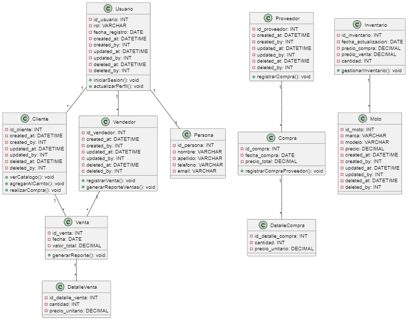

# Diagrama de Clases - Sistema de Ventas MotoMax

Este diagrama de clases muestra la estructura y relaciones entre las principales entidades del sistema de ventas de MotoMax. A continuación, se describe cada clase y su funcionalidad en el sistema.

## Descripción de Clases

### 1. Usuario
Esta clase representa a un usuario genérico del sistema. Incluye los atributos comunes para manejar el inicio de sesión, la actualización de perfil y la administración de metadatos de auditoría.

- **Atributos**: `id_usuario`, `rol`, `fecha_registro`, `created_at`, `created_by`, `updated_at`, `updated_by`, `deleted_at`, `deleted_by`.
- **Métodos**:
  - `iniciarSesion`: Permite al usuario iniciar sesión en el sistema.
  - `actualizarPerfil`: Permite al usuario actualizar sus datos personales.

### 2. Cliente
Representa a un cliente de MotoMax que puede comprar motos. Hereda la relación con la clase `Persona` a través de `Usuario`.

- **Atributos**: `id_cliente`, `created_at`, `created_by`, `updated_at`, `updated_by`, `deleted_at`, `deleted_by`.
- **Métodos**:
  - `verCatalogo`: Permite al cliente ver el catálogo de motos.
  - `agregarAlCarrito`: Permite al cliente agregar motos al carrito de compras.
  - `realizarCompra`: Permite al cliente finalizar la compra de las motos en el carrito.

### 3. Vendedor
Representa a un vendedor de MotoMax, quien puede registrar ventas y generar reportes de ventas.

- **Atributos**: `id_vendedor`, `created_at`, `created_by`, `updated_at`, `updated_by`, `deleted_at`, `deleted_by`.
- **Métodos**:
  - `registrarVenta`: Permite al vendedor registrar una venta.
  - `generarReporteVentas`: Permite al vendedor generar un reporte de las ventas realizadas.

### 4. Persona
Contiene la información personal de cada usuario, como nombre, apellido, teléfono y correo electrónico.

- **Atributos**: `id_persona`, `nombre`, `apellido`, `telefono`, `email`.

### 5. Proveedor
Representa a un proveedor de MotoMax, encargado de suministrar motos.

- **Atributos**: `id_proveedor`, `created_at`, `created_by`, `updated_at`, `updated_by`, `deleted_at`, `deleted_by`.
- **Métodos**:
  - `registrarCompra`: Permite al proveedor registrar una compra de motos al sistema.

### 6. Moto
Define las características de cada moto en el sistema, como marca, modelo y precio.

- **Atributos**: `id_moto`, `marca`, `modelo`, `precio`, `created_at`, `created_by`, `updated_at`, `updated_by`, `deleted_at`, `deleted_by`.

### 7. Inventario
Representa el inventario de motos de MotoMax, incluyendo la fecha de actualización y los precios.

- **Atributos**: `id_inventario`, `fecha_actualizacion`, `precio_compra`, `precio_venta`, `cantidad`.
- **Métodos**:
  - `gestionarInventario`: Permite al administrador gestionar el inventario de motos.

### 8. Compra
Representa una transacción de compra realizada al proveedor.

- **Atributos**: `id_compra`, `fecha_compra`, `precio_total`.
- **Métodos**:
  - `registrarCompraProveedor`: Permite registrar una compra de motos realizada a un proveedor.

### 9. DetalleCompra
Contiene los detalles específicos de cada compra, como la cantidad y el precio unitario de las motos compradas.

- **Atributos**: `id_detalle_compra`, `cantidad`, `precio_unitario`.

### 10. Venta
Representa una transacción de venta de motos a un cliente.

- **Atributos**: `id_venta`, `fecha`, `valor_total`.
- **Métodos**:
  - `generarReporte`: Permite generar un informe de ventas.

### 11. DetalleVenta
Contiene los detalles específicos de cada venta, como la cantidad y el precio unitario de las motos vendidas.

- **Atributos**: `id_detalle_venta`, `cantidad`, `precio_unitario`.

## Relaciones entre Clases

- **Usuario - Persona**: Cada usuario está asociado a una persona, de la cual hereda su información personal.
- **Cliente - Venta**: Cada cliente puede tener múltiples ventas asociadas.
- **Vendedor - Venta**: Cada vendedor puede registrar múltiples ventas.
- **Venta - DetalleVenta**: Cada venta incluye múltiples detalles de venta, representando las motos vendidas.
- **Compra - DetalleCompra**: Cada compra incluye múltiples detalles de compra, representando las motos adquiridas.
- **Proveedor - Compra**: Cada proveedor puede realizar múltiples compras de inventario para MotoMax.
- **Inventario - Moto**: El inventario gestiona las existencias de cada moto disponible en la tienda.

Este diagrama de clases proporciona una estructura detallada y organizada del sistema de ventas de MotoMax, permitiendo comprender cómo interactúan las entidades y las funciones principales de cada clase en el sistema.

