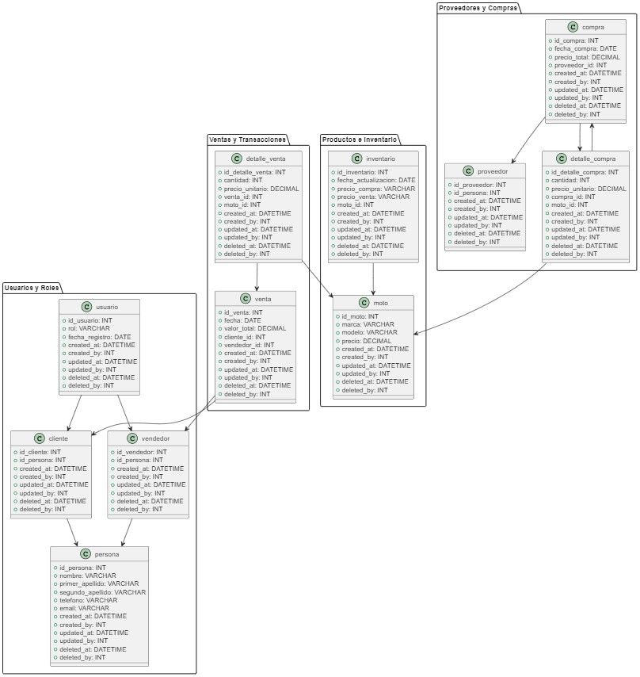

# Diagrama de Paquetes - Sistema de Ventas MotoMax

Este diagrama de paquetes representa la estructura del sistema de ventas de MotoMax. Cada paquete agrupa entidades relacionadas por su funcionalidad dentro del sistema, facilitando la modularidad y comprensión del modelo.

## Paquetes y Descripción

### 1. Paquete: Usuarios y Roles
Este paquete agrupa todas las entidades relacionadas con los usuarios y sus roles dentro del sistema. Incluye los datos generales de cada persona y su rol específico como cliente o vendedor.

- **usuario**: Representa la información de los usuarios del sistema, incluyendo su rol (cliente o vendedor) y la fecha de registro.
- **cliente**: Contiene la información específica de los clientes, haciendo referencia a los datos generales en la entidad `persona`.
- **vendedor**: Contiene la información específica de los vendedores, también enlazada a los datos generales en `persona`.
- **persona**: Representa la información general de cada persona, incluyendo su nombre, apellidos, teléfono, y correo electrónico.

**Relaciones:**
- `usuario` se asocia tanto con `cliente` como con `vendedor` a través del rol asignado.
- `cliente` y `vendedor` están relacionados con `persona` para asociar los datos personales.

### 2. Paquete: Productos e Inventario
Este paquete agrupa las entidades relacionadas con los productos (en este caso, motos) y el inventario.

- **moto**: Representa las características de cada moto en el sistema, como marca, modelo y precio.
- **inventario**: Contiene información sobre el inventario de motos, incluyendo la fecha de actualización y los precios de compra y venta.

**Relaciones:**
- `inventario` está relacionado con `moto`, ya que cada registro de inventario se asocia a un producto específico.

### 3. Paquete: Proveedores y Compras
Este paquete gestiona la información de los proveedores y los registros de compra de productos (motos).

- **proveedor**: Representa a los proveedores que suministran las motos.
- **compra**: Almacena información sobre cada transacción de compra, incluyendo la fecha y el proveedor asociado.
- **detalle_compra**: Almacena los detalles de cada compra, incluyendo la cantidad y el precio unitario de cada moto comprada.

**Relaciones:**
- `compra` está relacionada con `proveedor`, indicando el proveedor responsable de cada compra.
- `detalle_compra` está vinculado con `moto`, representando los detalles de cada unidad de producto comprada en una transacción.
- `detalle_compra` también se asocia a `compra`, enlazando cada detalle con una transacción específica.

### 4. Paquete: Ventas y Transacciones
Este paquete incluye las entidades relacionadas con las transacciones de venta y los detalles de cada venta.

- **venta**: Representa una transacción de venta, almacenando el valor total, la fecha y las referencias a cliente y vendedor.
- **detalle_venta**: Contiene los detalles de cada venta, como la cantidad y el precio unitario de cada moto vendida.

**Relaciones:**
- `venta` está relacionada con `cliente` y `vendedor`, ya que cada venta involucra a un comprador (cliente) y un representante de ventas (vendedor).
- `detalle_venta` está vinculado con `moto` y `venta`, indicando los detalles de los productos vendidos en cada transacción.

## Resumen de Relaciones entre Paquetes
Las relaciones entre los paquetes se basan en la dependencia entre entidades de diferentes áreas del sistema. Aquí se describen algunas de estas relaciones principales:

- El paquete **Usuarios y Roles** está relacionado con **Ventas y Transacciones** a través de las entidades `cliente` y `vendedor`, que participan en cada venta.
- El paquete **Proveedores y Compras** se conecta con **Productos e Inventario** mediante la relación entre `detalle_compra` y `moto`, donde cada compra detalla los productos adquiridos.
- **Productos e Inventario** y **Ventas y Transacciones** están vinculados mediante la relación entre `detalle_venta` y `moto`, representando los productos vendidos en cada transacción.

Este diseño de paquetes permite una organización clara del sistema y facilita la gestión de diferentes módulos de manera independiente.

